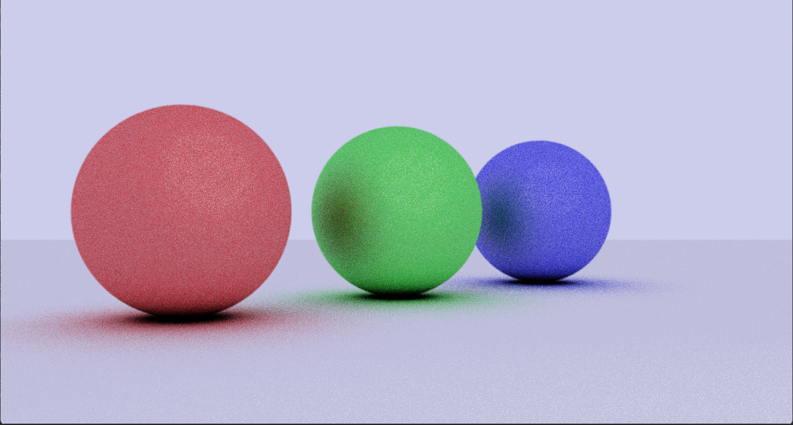
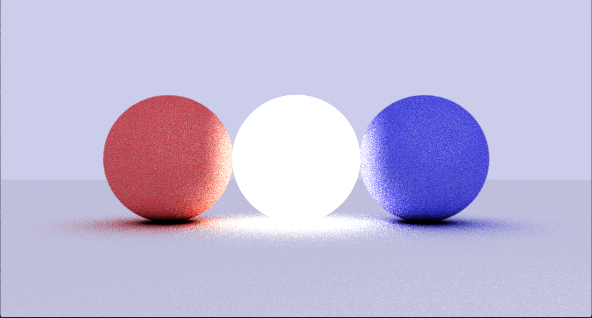
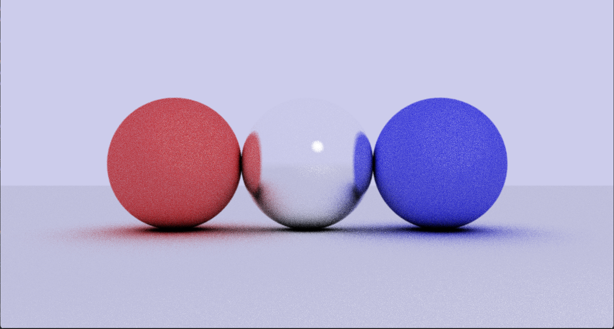
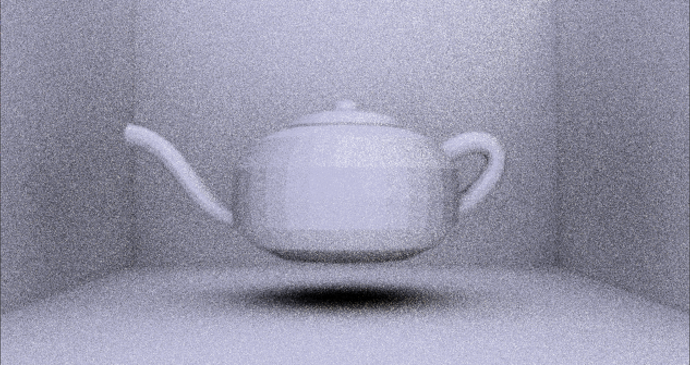
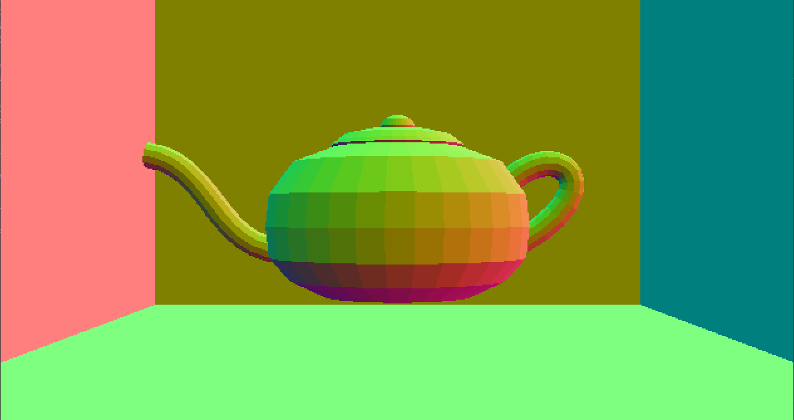

# Scala raytracer

A side project where I wanted to learn more about rendering and math

The renderer is written in Scala and uses scalaFX for the GUI

## Features

- Basic raytracing
- Basic shapes ( sphere, plane, triangle )
- Obj file loading and rendering using triangles ( rendering is slow )
- Materials ( diffuse, specular, reflective, emissive )
- Depth of field
- Multithreading ( manual chunking and threadcount )
- Anti aliasing
- Soft shadows using diffuse materials
- Camera fov
- Stacking images to reduce noise

The renderer uses cpu rendering and is not optimized for speed so it is very slow
I am interested in continuing this project and porting it to GPU language like CUDA

## Example Images

*Sample render*

*Sample render with DOF* 

*Sample render with emission*

*Sample render with reflection*

*Sample render of a model*

*Sample render of a model with normals*
